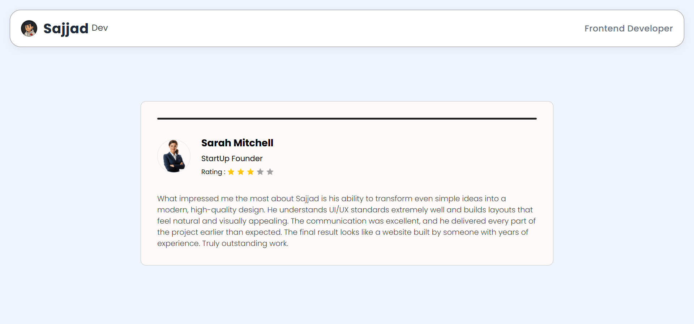

<h1 align="center"> Modern Comment Page</h1>

  <b>A clean, responsive, and modern comment page UI built with HTML & CSS & JS</b> 
  🌐 <a href="https://sajjadr17.github.io/modern-comment-page/">View Live Demo</a> • 💾 <a href="https://github.com/SajjadR17/modern-comment-page">View on GitHub</a>

---

### 🎨 Preview

  

---

## 🧠 About The Project

This project is a responsive Comment Section that automatically switches between comments created to practice and showcase front-end development skills.  
It features a soft card design, a smooth Progress Bar and a minimal UI for modern websites.

---

## ⚙️ Tech Stack

| Language       | Purpose          |
| :------------- | :--------------- |
| HTML5          | Structure        |
| CSS3 (Flexbox) | Styling & Layout |
| JS             | Switching        |

---

## 🌟 Features

✅ Fully responsive design (mobile-first)  
✅ Auto switching testmonials every **5 seconds**
✅ Clean spacing and typography  
✅ Minimall and modern ui
✅ Simple logic (HTML + CSS + JS)

---

## 🚀 Deployment

Deployed with Netlify in one click ⚡  
🔗 [View Live Demo](https://sajjadr17.github.io/modern-comment-page/)

---

## 🧭 How To Run Locally

`bash
git clone https://github.com/SajjadR17/modern-comment-page.git
cd contact-form
code .

---

## 🧾 License

This project is licensed under the MIT License — meaning you're free to use, modify, and share it,  
as long as you give proper credit to Sajjad Roohandeh.
